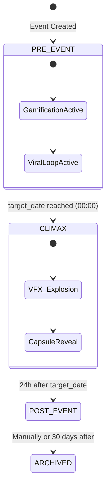

# 📚 BIRTHDAY COUNTER - FULL SYSTEM SPECIFICATION (CONSOLIDATED)

Este arquivo contém a documentação integral do projeto para processamento por agentes de IA externos.

---
# 1. MAP OF CONTENT (index.md)
---
# 🎂 Birthday Counter - Map of Content (MOC)

Bem-vindo à base de conhecimento consolidada do projeto **Birthday Counter Experience**. Esta estrutura foi otimizada para engenharia de sistemas.

## 🎯 Definição do Produto
*   **[[PRD]]**: Product Requirements Document. O Single Source of Truth para funcionalidades e requisitos técnicos.
*   **[[MONETIZATION_PLAN]]**: Estratégia de negócio, tiers de preço e economia de tokens.
*   **[[landing_page_design]]**: Estratégia de venda, conversão e entrada de novos usuários.
*   **[[systems_engineering_foundation]]**: Princípios de engenharia, arquitetura e feedback loops.

## 👥 Atores e Fluxos
*   **[[stakeholders]]**: Identificação de atores, papéis e matriz de interação sistêmica.
*   **[[user_journeys]]**: Mapeamento das jornadas do Aniversariante e dos Amigos, incluindo o fluxo de surpresa.

## 🛠️ Modelagem Técnica
*   **[[db_schema]]**: Modelagem física do banco de dados PostgreSQL e estratégia de cache Redis.
*   **[[api_design]]**: Contratos REST, WebSockets e política de acesso (RBAC).
*   **[[frontend_design]]**: Guia de estilo, UX de gamificação e arquitetura do frontend.

---
**Status Atual**: Planejamento Consolidado & Lean.
**Próximo Passo**: Iniciar modelagem técnica de dados.

---
# 2. PRODUCT REQUIREMENTS DOCUMENT (PRD.md)
---
# 📄 Product Requirements Document (PRD) V2: Detailed Specs

## 0. Aquisição e Onboarding (Funil de Vendas)

### 0.1 Landing Page
- **Objetivo**: Vender a experiência do "minuto zero" e cápsulas do tempo.
- **Métricas**: Taxa de conversão de visitantes para "Evento Criado".
- **Componentes**: Hero section, Social Proof, How it Works.

## 1. Módulo de Gamificação (Lógica de Negócio)

### 1.1 Memory Geoguessr
- **Input**: Foto com metadados GPS (Lat/Lng).
- **Processo**: O sistema oculta a localização e apresenta um mapa interativo.
- **Cálculo de Score**: 
  - `distancia = haversine(guess, actual)`
  - `score = max(0, 5000 * e^(-distancia / 1000))` (5000 pontos max, decai com a distância em km).
- **Coins**: `coins = score / 10`.

### 1.2 Fact or Fiction (AI Engine)
- **Input**: `bio_storytelling` do Host + Comentários de Amigos.
- **Processo**: LLM gera 3 afirmações: 2 reais (extraídas da bio) e 1 mentira plausível (criada pela IA).
- **Score**: Fixo 500 pontos por acerto.

### 1.3 Timeline Reorder
- **Processo**: Seleção aleatória de 3-5 fotos do `media_repository` que possuam `date_taken` no metadata.
- **Score**: 1000 pontos se 100% correto; 0 caso contrário.

## 2. Economia de Coins e Streaks
- **Daily Streak**: 
  - Dia 1: Multiplicador 1x
  - Dia 3+: Multiplicador 1.5x
  - Dia 7+: Multiplicador 2x (Max).
- **Loja de Efeitos (Spending)**:
  - Chuva de Emojis (500 coins) - Dura 10 min para todos no evento.
  - Priorizar Música (1000 coins) - Move música para o topo da fila Spotify.
  - Reveal Midia VIP (5000 coins) - Desbloqueia foto "rara".

## 3. Viral Loop & Social Sharing
- **OG Image Engine**: Serviço que renderiza um template HTML/CSS para PNG via Playwright/Puppeteer.
- **Dynamic Assets**:
  - `share/milestone/:id`: "Batemos 1000 mensagens!".
  - `share/ranking/:id`: "Estou no Top 3 da festa do [Host]!".

## 4. Módulo de Administração (Backoffice)
- **Métricas Críticas**: 
  - DAU (Daily Active Users) por Evento.
  - Taxa de Conversão Sponsor -> Host.
- **Ferramentas de Moderação**:
  - `Shadowban`: Usuário vê suas mensagens, mas ninguém mais vê.
  - `Event Freeze`: Bloqueia novas interações mas mantém visualização.

## 5. Regras de Transição (Dia Zero)
- **Trigger**: Server-side cron check a cada minuto.
- **Ação**:
  1. Alterar `status` do evento para `CLIMAX`.
  2. Emitir evento WebSocket `CELEBRATION_TRIGGER`.
  3. Atualizar flag `is_revealed` em todas as `Messages` do evento.
---
# 3. MONETIZATION PLAN (MONETIZATION_PLAN.md)
---
# 💰 Plano de Monetização: Birthday Counter Experience

Este documento detalha a estratégia de negócio e os modelos de receita para a plataforma **Birthday Counter Experience**, fundamentado em pesquisas de mercado de [[SaaS]] e [[Gamificação]] (2024-2025).

## 1. Visão Geral do Modelo de Negócio
A plataforma adotará um **Modelo de Monetização Híbrido**, combinando receita recorrente ([[SaaS]]), transações pontuais ([[Micro-transações]]) e parcerias [[B2B]]. O objetivo é equilibrar a aquisição viral com a extração de valor de "Power Users".

## 2. Estrutura de Camadas (Tiered Pricing)

### 2.1 Camada Free (O Gancho Viral)
*   **Acesso**: Gratuito para 1 evento ativo.
*   **Funcionalidades**: Jogos básicos ([[Memory Geoguessr]], [[Fact or Fiction]]), 500MB de armazenamento de mídia.
*   **Monetização Indireta**: Anúncios não intrusivos e limites de "Coins" diários.

### 2.2 Camada Premium (One-Time Event Pass)
*   **Público**: Usuários que querem uma experiência épica para um aniversário específico.
*   **Preço**: Pagamento único por evento (ex: R$ 29,90).
*   **Vantagens**:
    *   Remoção total de anúncios para todos os convidados.
    *   **VIP Media Reveal**: Desbloqueio de fotos raras via [[Micro-transações]].
    *   Customização completa da [[Landing Page]] do evento.
    *   Armazenamento ilimitado durante o período do evento.

### 2.3 Camada Pro (Assinatura Anual/Creator)
*   **Público**: Influenciadores, organizadores de festas e usuários "festeiros".
*   **Vantagens**:
    *   Eventos ilimitados.
    *   [[Analytics]] avançado (quem mais interagiu, alcance das [[OG Image Engine|fotos compartilhadas]]).
    *   Suporte prioritário e acesso antecipado a novos jogos de [[AI]].

## 3. Economia Gamificada (Birthday Coins)
A moeda virtual do sistema serve para aumentar o [[Engagement]] e criar fluxos de receita transacional.

| Item de Gasto | Custo (Coins) | Efeito Sistêmico |
| :--- | :--- | :--- |
| **Chuva de Emojis** | 500 | Feedback visual em tempo real via [[WebSockets]]. |
| **Prioridade Spotify** | 1000 | Altera a fila de reprodução do evento. |
| **Dica de Jogo** | 200 | Ajuda no [[Memory Geoguessr]] (reduz raio de busca). |
| **Streak Freeze** | 1500 | Mantém o multiplicador de coins se o usuário falhar um dia. |

## 4. Estratégia B2B e Patrocínios (Sponsorships)
Transformar a plataforma em um canal de [[Lead Generation]] para o ecossistema de festas.

1.  **Branded Quizzes**: Marcas (ex: uma marca de bebidas) podem patrocinar rodadas de [[Fact or Fiction]] com prêmios reais (cupons de desconto).
2.  **Marketplace de Fornecedores**: Cobrança de comissão (Affiliate Fee) por indicações de Buffets, DJs e Decoradores integrados à [[User Journeys|Jornada do Aniversariante]].
3.  **Sponsored "Social Gifts"**: Marcas podem oferecer "efeitos de loja" gratuitos em troca de visualização de marca.

## 5. Viral Loop como Driver de Receita
A utilização do [[OG Image Engine]] para gerar assets dinâmicos de "Ranking" e "Milestones" atua como [[Product Led Growth]] (PLG). Cada compartilhamento em redes sociais reduz o CAC (Custo de Aquisição de Cliente) e aumenta a base de usuários para conversão em tiers pagos.

---
# 4. SYSTEMS ENGINEERING FOUNDATION (systems_engineering_foundation.md)
---
# 🏗️ Fundamentos de Engenharia de Sistemas (V2 - Hardened)

Este documento estabelece as diretrizes técnicas imutáveis para o desenvolvimento do **Birthday Counter Experience**.

## 1. Stack Tecnológica Obrigatória
- **Frontend**: Next.js 14+ (App Router), TypeScript, TailwindCSS, Framer Motion (VFX), Lucide React (Icons).
- **Backend (API)**: FastAPI (Python 3.11+) para processamento pesado/IA ou Node.js (NestJS) para I/O intenso. *Decisão: FastAPI para melhor integração com bibliotecas de IA.*
- **Database**: PostgreSQL 15+ (Relacional), Redis 7+ (Cache/Real-time).
- **Storage**: MinIO or AWS S3 (Mídias) com suporte a Content-Type dinâmico.
- **Real-time**: WebSockets (FastAPI integration) or Pusher/Ably para escalabilidade.

## 2. Arquitetura de Estados (System States)
O sistema deve se comportar como uma Máquina de Estados Finita (FSM) vinculada ao `target_date`:



## 3. Princípios de Desenvolvimento para IA
1.  **Strict Typing**: Uso de Pydantic (Python) e Interfaces TypeScript em 100% do código.
2.  **Stateless API**: Todo estado de sessão deve residir no JWT ou Redis.
3.  **Idempotência**: Endpoints de transação de Coins (`/shop/buy`) devem ser idempotentes via `request_id`.
4.  **Error Handling**: Formato padrão de erro: `{ "error": "code", "message": "readable", "detail": {} }`.

## 4. Estratégia de Deploy (CI/CD)
- **Containerização**: Multi-stage build Dockerfiles para otimização de imagem.
- **Orquestração**: Docker Compose (MVP) -> Kubernetes (Scale).
- **Network**: Nginx como Proxy Reverso + Certbot (SSL).
---
# 5. STAKEHOLDERS (stakeholders.md)
---
# 👥 Análise de Stakeholders e Matriz de Interação

Este documento identifica os atores (humanos e sistêmicos) envolvidos no ecossistema **Birthday Counter Experience** e como eles interagem entre si, baseando-se em princípios de engenharia de sistemas.

## 1. Identificação de Stakeholders

### 1.1 Stakeholders Primários (Usuários Finais)
| Ator | Papel no Sistema | Objetivo Principal |
| :--- | :--- | :--- |
| **Aniversariante (Host)** | Proprietário do Evento | Ter uma experiência memorável e receber afeto. |
| **Amigo Organizador (Sponsor)** | Criador do Evento (Surpresa) | Iniciar a celebração e mobilizar o grupo. |
| **Amigo (Guest)** | Colaborador e Jogador | Competir no ranking e demonstrar afeto ao host. |

### 1.2 Stakeholders de Governança (Administração)
| Ator | Papel no Sistema | Objetivo Principal |
| :--- | :--- | :--- |
| **Administrador (Admin)** | Gestão Global e Moderação | Garantir a integridade da plataforma, segurança dos dados e suporte aos usuários. |

### 1.3 Stakeholders Secundários (Sistêmicos/Suporte)
| Ator | Papel no Sistema | Objetivo Principal |
| :--- | :--- | :--- |
| **AI Engine (Systemic Actor)** | Processador de Dados | Gerar conteúdo dinâmico (quizzes/stories). |
| **Provedores Externos** | Infraestrutura | Spotify, Mapas, Cloudflare. |

## 2. Matriz de Interação (Systems Perspective)

### A. Admin ↔ Sistema (Management Layer)
- **Input**: Comandos de moderação, ajuste de parâmetros de jogo, auditoria de logs.
- **Valor**: Plataforma segura, livre de abusos e tecnicamente otimizada.

### B. Admin ↔ Usuários (Support Loop)
- **Input**: Resolução de tickets, suspensão de contas maliciosas.
- **Valor**: Confiança do usuário e manutenção da comunidade.

### C. Sponsor ↔ Sistema (Cold Start)
- **Input**: Criação do evento surpresa; preenchimento inicial de dados do Host.
- **Valor**: Autonomia para criar o hype antes mesmo do Host estar ciente.

### D. Host ↔ Sistema (Activation & Curation)
- **Input**: Aceite do convite; complementação da Bio; moderação local do mural.
- **Valor**: Personalização e controle da própria celebração.

### E. Guest ↔ Sistema (Engagement Loop)
- **Input**: Respostas de jogos, moedas gastas, contribuições sociais.
- **Valor**: Diversão e pontuação no ranking.

## 3. Requisitos por Stakeholder (High-Level)

1.  **Admin**: Necessita de uma interface de "Backoffice" potente, com logs de auditoria imutáveis.
2.  **Host**: Necessita de ferramentas de privacidade (ex: quem pode ver minhas fotos).
3.  **Guest**: Necessita de uma UI gamificada e feedback visual de progresso.
4.  **Sponsor**: Necessita de anonimato parcial até o momento da revelação.

---
# 6. USER JOURNEYS (user_journeys.md)
---
# 🗺️ User Journeys & Edge Cases (V2)

## 1. Fluxo de Recuperação e Mudança de Data
- **Cenário**: Host precisa alterar a data do aniversário.
- **Regra**: 
  - Se a nova data for **mais distante**, o sistema estende o countdown e as cápsulas permanecem bloqueadas.
  - Se a nova data for **mais próxima**, o sistema recalcula os milestones. 
  - Se a data já passou, o evento entra em `CLIMAX` imediatamente.

## 2. Fluxo de Abandono (Inactive Host)
- **Cenário**: Sponsor criou o evento, mas o Host nunca ativou.
- **Regra**: Após 7 dias da `target_date` sem ativação, o evento é auto-arquivado. O Sponsor recebe uma notificação de "Festa não realizada".

## 3. Conflito de Coin Spending
- **Cenário**: Dois usuários tentam "comprar" o topo da playlist simultaneamente.
- **Solução**: Implementação de **Redis Distributed Lock** na chave do leilão para garantir atomicidade.

## 4. Moderação em Tempo Real
- **Fluxo**:
  1. IA detecta 80% de probabilidade de conteúdo ofensivo (via OpenAI Moderation API ou similar).
  2. Mensagem é marcada como `PENDING_APPROVAL`.
  3. Admin recebe notificação via WebSocket no painel.
  4. Admin aprova ou remove.
---
# 7. DATABASE SCHEMA (db_schema.md)
---
# 🗄️ Database Schema (V2 - Optimized)

## 1. Extensões Obrigatórias
```sql
CREATE EXTENSION IF NOT EXISTS "uuid-ossp";
CREATE EXTENSION IF NOT EXISTS "pg_trgm"; -- Para busca de nomes/mensagens
```

## 2. Índices e Performance
- `CREATE INDEX idx_events_status ON events(status);`
- `CREATE INDEX idx_rankings_event_score ON rankings(event_id, total_score DESC);`
- `CREATE INDEX idx_messages_event_revealed ON messages(event_id, is_revealed);`
- `CREATE UNIQUE INDEX idx_unique_active_event_host ON events(host_id) WHERE status = 'ACTIVE';`

## 3. Detalhamento de JSONB Schemas

### 3.1 `users.profile_data`
```json
{
  "full_name": "string",
  "avatar_url": "url",
  "preferences": {
    "notifications": "boolean",
    "theme": "dark|light"
  }
}
```

### 3.2 `events.config`
```json
{
  "theme_id": "uuid",
  "vfx_enabled": "boolean",
  "ai_complexity": "low|medium|high",
  "spotify_playlist_id": "string",
  "milestones": [
    {"type": "messages", "target": 100, "achieved": false}
  ]
}
```

## 4. Constraints de Integridade
- **Coins**: `ALTER TABLE coin_transactions ADD CONSTRAINT positive_amount CHECK (amount <> 0);`
- **Ranking**: `ALTER TABLE rankings ADD CONSTRAINT score_non_negative CHECK (total_score >= 0);`
- **Events**: `ALTER TABLE events ADD CONSTRAINT target_date_future CHECK (target_date > created_at);`

---
# 8. API DESIGN (api_design.md)
---
# 🔌 API Design (V2 - Request/Response Payloads)

## 1. Gamificação: Play Game
`POST /events/:id/games/:type/play`

**Request Body (Geoguessr):**
```json
{
  "game_id": "uuid",
  "guess": {
    "lat": -23.5505,
    "lng": -46.6333
  },
  "client_timestamp": "ISO8601"
}
```

**Response (200 OK):**
```json
{
  "score": 4850,
  "coins_earned": 485,
  "distance_km": 0.52,
  "new_total_score": 12500,
  "rank_position": 2
}
```

## 2. Real-time: WebSocket Messages
**Event: `RANKING_UPDATE`**
```json
{
  "event_type": "RANKING_UPDATE",
  "payload": {
    "top_3": [
      {"user_id": "uuid", "name": "Alice", "score": 15000},
      {"user_id": "uuid", "name": "Bob", "score": 14500},
      {"user_id": "uuid", "name": "You", "score": 12500}
    ]
  }
}
```

## 3. Social: Capsule Message
`POST /events/:id/messages`

**Multipart Form Data:**
- `type`: "VIDEO"
- `file`: Binary Data (mp4)
- `sender_name`: "Opcional se logado"

**Response (201 Created):**
```json
{
  "id": "uuid",
  "status": "LOCKED",
  "reveal_date": "2026-05-12T00:00:00Z"
}
```

## 4. Auth: Login
`POST /auth/login`

**Response:**
```json
{
  "access_token": "jwt_string",
  "refresh_token": "jwt_string",
  "user": {
    "id": "uuid",
    "role": "HOST|GUEST|ADMIN",
    "name": "string"
  }
}
```
---
# 9. FRONTEND DESIGN (frontend_design.md)
---
# 🎨 Frontend Design Specification: Birthday Counter Experience

## 1. Visão Geral do Design (Aesthetics)
O design deve evocar um sentimento de **antecipação, celebração e interatividade**. Abandonamos o visual estático em favor de uma interface "viva" que reage às ações do usuário e à proximidade do evento.

### 1.1 Estilo Visual: Modern Festive Dark
- **Base**: Dark Mode por padrão para destacar cores vibrantes e efeitos de partículas.
- **Glassmorphism**: Uso intensivo de cartões translúcidos com `backdrop-filter: blur()` para criar profundidade.
- **Micro-interações**: Feedback tátil e visual em cada clique (Framer Motion).

## 2. Design System

### 2.1 Cores (Palette)
- **Background**: `#0F172A` (Slate 950)
- **Primary (Celebration)**: `#8B5CF6` (Violet 500) -> `#D946EF` (Fuchsia 500) gradient.
- **Secondary (Coins/Success)**: `#F59E0B` (Amber 500)
- **Accent (Urgency)**: `#EF4444` (Red 500)
- **Surface**: `rgba(30, 41, 59, 0.7)` (Slate 800 com transparência)

### 2.2 Tipografia
- **Headings**: `Montserrat` ou `Inter` (Extra Bold) para títulos impactantes.
- **Digits (Countdown)**: `JetBrains Mono` ou `Space Mono` (Monospaced) para evitar "pulos" durante a contagem.
- **Body**: `Inter` (Medium/Regular) para legibilidade.

### 2.3 Componentes (Base: Tailwind + Radix/Shadcn)
- **Cards**: Bordas sutis (`border-white/10`) e sombras suaves.
- **Buttons**: Gradientes vibrantes com efeito de "glow" no hover.
- **Progress Bars**: Estilo "Liquid" (fluído) para indicar progresso de coins ou streaks.

## 3. Layout Responsivo (Mobile-First)

### 3.1 Mobile (< 768px)
- **Header**: Countdown fixo no topo com tipografia grande.
- **Main Content**: Scroll vertical de cartões de gamificação (um por linha).
- **Navigation**: Bottom Tab Bar para acesso rápido: [Home, Games, Shop, Ranking].

### 3.2 Desktop (>= 768px)
- **Header**: Sidebar ou Top Nav elegante.
- **Main Content**: Grid de 2 ou 3 colunas.
- **Real-time Feed**: Sidebar lateral com as últimas mensagens e atividades.

## 4. Design por Papel (Role-Based UI)

### 4.1 Admin/Host Dashboard
- **Visão de Moderação**: Lista de mensagens `PENDING_APPROVAL` com ações rápidas de Aprovar/Remover.
- **Métricas**: Gráficos simples de DAU e engajamento.
- **Controles**: Botão de "Event Freeze" em destaque.

### 4.2 Guest (Participante)
- **Status de Moedas**: Badge flutuante persistente mostrando o saldo atual.
- **Ranking Real-time**: Widget compacto que desliza do topo ou lateral em atualizações de WebSocket.

## 5. Design de Jogos (Gamification UI)

### 5.1 Memory Geoguessr
- **UI**: Mapa interativo ocupando 70% da viewport.
- **Overlay**: Painel flutuante com a foto a ser adivinhada.
- **Feedback**: Animação de linha conectando o "chute" ao local real com score flutuante.

### 5.2 Fact or Fiction
- **UI**: Cartões estilo "Tinder" ou botões grandes de alta fidelidade.
- **VFX**: Explosão de confetti verde no acerto, tremor vermelho no erro.

### 5.3 Timeline Reorder
- **UI**: Lista horizontal de miniaturas de fotos com ícones de "drag" visíveis.
- **UX**: Feedback de animação suave ao reordenar (Reorder.Group do Framer Motion).

## 6. Estados Visuais (System States)

| Estado | UI / Atmosfera |
| :--- | :--- |
| **PRE_EVENT** | Foco no Countdown. Cores roxas/azuis. Gamificação em destaque. |
| **CLIMAX (00:00)** | Explosão de VFX. Cores Gold/Fuchsia. Reveal central da cápsula do tempo. |
| **POST_EVENT** | Layout de galeria/museu. Tons mais sóbrios e nostálgicos. |

## 7. Referências e Inspirações
- **App Forest**: Pelo loop de crescimento visual (Gamificação).
- **Airbnb Maps**: Pela fluidez da interface de mapa.
- **Duolingo**: Pelo uso de streaks e feedback de acerto/erro.

---
# 10. FRONTEND (FRONTEND.md)
---
# Birthday Counter Experience - Frontend Documentation

## Visão Geral do Frontend

O frontend do **Birthday Counter Experience** foi desenvolvido com **Ruby on Rails 7.1 + Hotwire** para uma experiência moderna, rápida e mobile-first, com design aprimorado usando **Tailwind CSS** e animações fluidas.

### Stack Tecnológico

- **Framework**: Ruby on Rails 7.1
- **Frontend Stack**: Hotwire (Turbo + Stimulus)
- **Estilização**: TailwindCSS 3.0+
- **JavaScript**: Importmap (sem build step)
- **Ícones**: Heroicons
- **Fontes**: Inter, Montserrat, JetBrains Mono
- **Animações**: Stimulus controllers + Tailwind animations
---
# 14. ENGINEERING NOTES (engineering/engineering_notes.md)
---
# 🚀 Birthday Counter Engineering Notes

Project implement Birthday Counter Experience. 
Stack: Ruby on Rails 7.1 (FE + BE) + Hotwire + PostgreSQL.
Deploy: Docker Compose on VPS.

## 🛠 Design Decisions

### Frontend Stack
1. **Ruby on Rails 7.1**: Full-stack framework with Hotwire for SPA-like experience
2. **Hotwire (Turbo + Stimulus)**: No JavaScript framework needed, fast dev loop
3. **TailwindCSS 3.0+**: Utility-first CSS with custom design system
4. **Importmap**: No build step for JavaScript modules

---
# 15. HOST INVITATION FLOW (engineering/host_invitation_flow_design.md)
---
# 📋 Design Document: Host Invitation Flow (Surprise Activation)

## 1. Problem Statement
Atualmente, a criação de eventos exige um `host_id` obrigatório. Para eventos surpresa (onde o Sponsor cria o evento para o Aniversariante), precisamos de um mecanismo onde o evento seja criado "em espera" até que o Aniversariante (Host) o reivindique (claim) através de um link de convite.

## 2. Proposed Solution
Introduzir o conceito de `invitation_token` na tabela `events` e permitir que `host_id` seja nulo inicialmente se `is_surprise` for verdadeiro.

### 2.3 Routing
- `GET /invite/:token` -> `invitations#show` (Exibe a surpresa).
- `POST /invite/:token/claim` -> `invitations#claim` (Associa o usuário logado como Host).

---
# 16. TESTING STRATEGY (engineering/testing_strategy.md)
---
# 🧪 Estratégia de Testes (Ruby on Rails + Docker)

Este projeto utiliza **RSpec** como framework de testes principal, executado inteiramente dentro de containers Docker.

## 🚀 Como Executar os Testes

Como não há Ruby instalado localmente, todos os comandos devem ser prefixados com `docker compose run --rm api`.

### 1. Executar todos os testes
```bash
docker compose run --rm api bundle exec rspec
```

---
# 17. EMAIL IMPLEMENTATION (engineering/EMAIL_IMPLEMENTATION.md)
---
# 📧 Implementação do Sistema de Emails

## 📋 Visão Geral
A funcionalidade de email foi consolidada e expandida para suportar convites de convidados, além das notificações já existentes de countdown e surpresas.

## 🛠️ Mudanças Realizadas
- **Development**: Configurado `letter_opener` para visualização de emails no browser.
- **Background Jobs**: Definido `Sidekiq` como queue adapter.
- **Mailers**: `NotificationMailer` configurado com hosts dinâmicos.

---
# 18. FIXES APPLIED (engineering/FIXES_APPLIED.md)
---
# 🛠 Relatório de Correções Técnicas - Design & Assets

### 1. Problema: Assets Não Carregados
**Solução**: Atualizado `manifest.js` para incluir `//= link_tree ../builds`.

### 2. Problema: Falha no Build do Docker
**Solução**: Refatorado `app/javascript/controllers/index.js` para registro manual do Stimulus.

---
# 19. DESIGN CONCEPTS (visuals/DESIGN_CONCEPTS.md)
---
# Birthday Counter Visual Concepts

## 1. Visual Identity: "Modern Festive Dark"
O design utiliza fundo Slate (`#0F172A`) com glassmorphism e cores vibrantes.

---
**FIM DO ARQUIVO CONSOLIDADO**
---
# 11. DESIGN SYSTEM (DESIGN_SYSTEM.md)
---
# Design System - Birthday Counter

## Visão Geral

Este documento descreve o design system do Birthday Counter Experience, incluindo cores, tipografia, componentes, e padrões de uso.

## Princípios de Design

1. **Modern Festive**: Celebração com elegância, não exagero
2. **Mobile-First**: Otimizado para dispositivos móveis
3. **Accessible**: Acessível para todos os usuários
4. **Performant**: Rápido e responsivo
5. **Consistent**: Padrões consistentes em toda a aplicação

## Cores

### Palette Principal

```
Background:     #0F172A  (Slate 950)
Surface:        rgba(30, 41, 59, 0.7)  (Slate 800 com transparência)

Primary:        #8B5CF6  (Violet 500)
Primary Hover:  #7C3AED  (Violet 600)
Primary Glow:   rgba(139, 92, 246, 0.5)

Fuchsia:        #D946EF  (Fuchsia 500)
Fuchsia Glow:   rgba(217, 70, 239, 0.5)

Secondary:      #F59E0B  (Amber 500)
Secondary Hover: #D97706 (Amber 600)

Accent:         #EF4444  (Red 500)
Success:        #10B981  (Emerald 500)
Info:           #3B82F6  (Blue 500)
Cyan:           #06B6D4  (Cyan 500)
```

---
# 12. LANDING PAGE DESIGN (landing_page_design.md)
---
# 🚀 Landing Page Design Specification: "Venda" da Experiência

## 1. Objetivo de Negócio
A Landing Page é a porta de entrada para novos usuários (Sponsors e Hosts). Seu objetivo é converter visitantes em criadores de eventos através de uma narrativa de antecipação e celebração digital.

## 2. Estrutura de Conteúdo (Narrativa)

### 2.1 Hero Section (O Gancho)
- **Título**: "Transforme a espera pelo aniversário na própria festa."
- **Subtítulo**: "Crie cápsulas do tempo, jogos personalizados e uma contagem regressiva interativa que explode em celebração no minuto zero."
- **CTA Principal**: [Criar Minha Celebração] (Leva ao fluxo de onboarding/registro).
- **Visual**: Mockup animado do Countdown e efeitos de partículas.

### 2.2 Social Proof & Funcionalidades (O Valor)
- **Cápsulas de Memória**: Amigos deixam mensagens e mídias que só abrem no Clímax.
- **Gamificação Social**: Geoguessr de memórias, Fact or Fiction sobre o aniversariante.
- **Economia de Coins**: Ganhe coins jogando e gaste em efeitos na festa em tempo real.

### 2.3 How it Works (O Processo)
1. **Crie o Evento**: Defina a data e o aniversariante.
2. **Convide a Galera**: Envie o link para os amigos começarem a gamificação.
3. **O Clímax**: No minuto zero, a plataforma se transforma e revela todas as surpresas.

---
# 13. FUNCTIONAL SPEC (engineering/functional_spec.md)
---
# 📋 Especificação Funcional e Diretrizes de Desenvolvimento

Este documento detalha as funcionalidades do **Birthday Counter Experience** para guiar os agentes de Desenvolvimento e Testes.

## 1. Ciclo de Vida do Evento (FSM)
O sistema deve gerenciar rigorosamente os estados do evento baseados no `target_date`.

### 1.1 Estados
- **ACTIVE**: Antes do `target_date`. Gamificação liberada, mensagens ocultas (is_revealed: false).
- **CLIMAX**: No momento exato do `target_date`. Dispara animações (VFX), revela mensagens, encerra gamificação.
- **POST_EVENT**: 24h após o Clímax. Modo de visualização/memória.
- **ARCHIVED**: 30 dias após ou manual. Somente leitura histórica.

### 1.2 Transições Críticas
- **Trigger**: `EventStatusCheckJob` (Sidekiq) executado a cada minuto.
- **Ação Clímax**: Alterar `status` para `climax`, setar `is_revealed: true` em todas as mensagens do evento, disparar broadcast via ActionCable.
