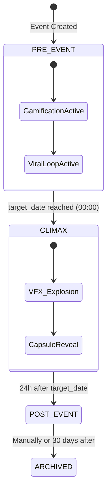

# 🏗️ Fundamentos de Engenharia de Sistemas (V2 - Hardened)

Este documento estabelece as diretrizes técnicas imutáveis para o desenvolvimento do **Birthday Counter Experience**.

## 1. Stack Tecnológica Obrigatória
- **Frontend**: Next.js 14+ (App Router), TypeScript, TailwindCSS, Framer Motion (VFX), Lucide React (Icons).
- **Backend (API)**: FastAPI (Python 3.11+) para processamento pesado/IA ou Node.js (NestJS) para I/O intenso. *Decisão: FastAPI para melhor integração com bibliotecas de IA.*
- **Database**: PostgreSQL 15+ (Relacional), Redis 7+ (Cache/Real-time).
- **Storage**: MinIO ou AWS S3 (Mídias) com suporte a Content-Type dinâmico.
- **Real-time**: WebSockets (FastAPI integration) ou Pusher/Ably para escalabilidade.

## 2. Arquitetura de Estados (System States)
O sistema deve se comportar como uma Máquina de Estados Finita (FSM) vinculada ao `target_date`:

## 3. Princípios de Desenvolvimento para IA
1.  **Strict Typing**: Uso de Pydantic (Python) e Interfaces TypeScript em 100% do código.
2.  **Stateless API**: Todo estado de sessão deve residir no JWT ou Redis.
3.  **Idempotência**: Endpoints de transação de Coins (`/shop/buy`) devem ser idempotentes via `request_id`.
4.  **Error Handling**: Formato padrão de erro: `{ "error": "code", "message": "readable", "detail": {} }`.

## 4. Estratégia de Deploy (CI/CD)
- **Containerização**: Multi-stage build Dockerfiles para otimização de imagem.
- **Orquestração**: Docker Compose (MVP) -> Kubernetes (Scale).
- **Network**: Nginx como Proxy Reverso + Certbot (SSL).
